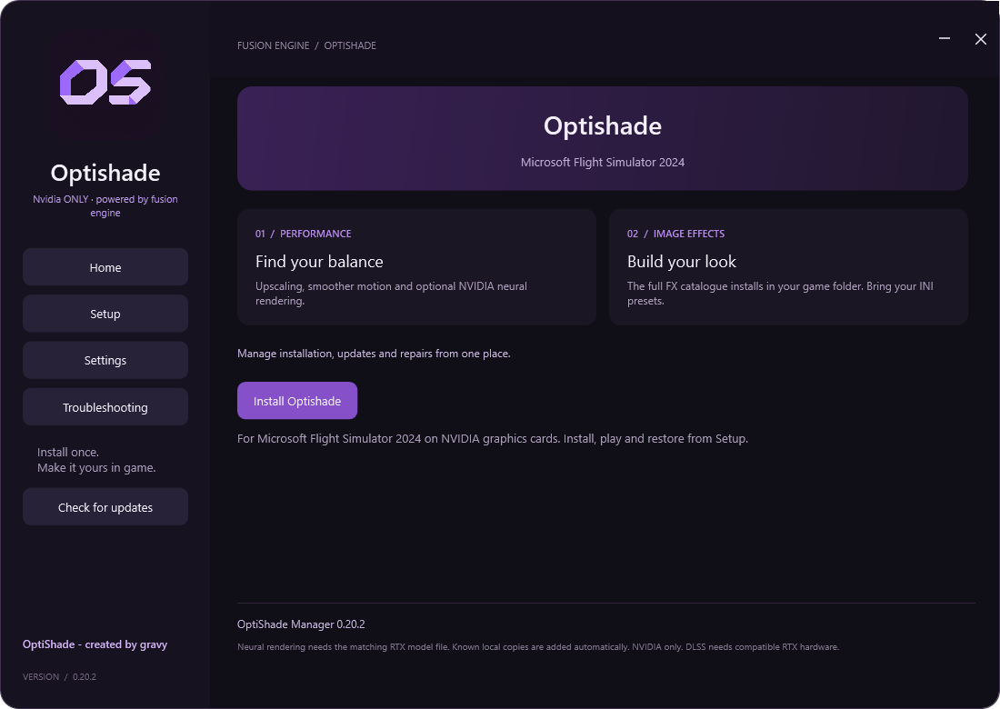

  
  <h1>Optishade</h1>
  
<strong>Microsoft Flight Simulator 2024 · MSFS 2020 experimental testing</strong>

  
Created by gravy · Powered by Fusion Engine

  

    
    
    
  

  
<a href="https://github.com/GamingWithGravy/OptiShade/releases/latest"><strong>Download OptiShade Manager</strong></a> · <a href="docs/Tutorial.txt">Getting started</a> · <a href="docs/Features.txt">Features</a> · <a href="BUILDING.md">Build from source</a>

## Your flight. Your look.

Optishade brings image effects, saved looks and optional NVIDIA neural rendering together in one custom in-game menu. This edition is built for **Microsoft Flight Simulator 2024 on NVIDIA and AMD graphics cards (AMD support is early experimental)**, with automatic Steam and Xbox detection.

### New in 0.20.7: MSFS 2020 experimental testing

This is the **first public release enabling MSFS 2020**. A Steam installation with an **RTX 5090** successfully loaded OptiShade; game logs confirmed the DLSS connection and active Neural Rendering at 3840 × 2160, including two passes. Support remains experimental: Xbox startup, older RTX Neural Rendering, frame generation and triple-monitor stability need further real-system testing. Select **Microsoft Flight Simulator 2020 (test)** in the manager. See the [testing guide and limitations](docs/Local-0207-testing.md).

### Image effects

Search your FX shaders, switch effects on, adjust their settings and save a named INI preset. Browse downloaded presets from inside the game and copy them into your game presets folder. Overwrite warnings and Revert changes help you keep the looks you want.

### Optional NVIDIA features

Neural rendering always starts **off**, even with older saved settings. Your tuning
values are retained; enable neural rendering manually for each game session.
[TAA neural rendering](docs/TAA-preview.md) is Coming soon (INOP) and disabled in this release.

Choose **Yes or No** when setup asks about DLSS 5. Neural rendering requires compatible RTX hardware, a matching model and a supported game connection. Installing files does not automatically enable it or prove it is rendering. Extra effects and neural passes can reduce frame rate.

### An interface you can make your own

Press **Insert** or **Ctrl+Shift+O** to open the menu. Shortcuts are configurable in the manager’s Keybinds tab. Purple is the default; choose a different overlay accent in Settings & status and save it for your game. Close the installer after setup finishes—the in-game menu runs independently.

## Install in a few steps

1. Download the EXE from [Releases](https://github.com/GamingWithGravy/OptiShade/releases/latest).
2. Close the simulator and open **Setup**.
3. Select the detected Steam or Xbox installation.
4. Click **Install Optishade** and choose whether to add the optional NVIDIA files.
5. Wait for installation and downloads to finish, close the installer and start your game.
6. Press **Insert**.

Standard and SweetFX shaders are bundled for offline installation. Internet access is needed for additional effect packs, optional NVIDIA downloads and update checks. A preset needs its required FX files installed. The full Tutorial, How It Works and Features guides are bundled in the EXE under **Settings → Tutorial, how it works and features** and available in [docs](docs).

## Restore and uninstall

Close the game before changing installed files. **Restore** removes tracked Optishade files and restores backups while keeping saved presets. **Uninstall** offers a choice to keep your presets and covers all installations recorded by Optishade, including earlier editions. Game settings, controls and saves are not installation targets.

## How it is built

Fusion Engine is the name for Optishade's integration of modified [ReShade](https://github.com/crosire/reshade) and [OptiScaler-DLSSNR-PreSR-Multipass](https://github.com/wilsjo2/OptiScaler-DLSSNR-PreSR-Multipass), including RenoDX-derived colour processing, with gravy's installer and interface. Underlying technologies retain their authors' credits and licences. See [NOTICE.md](NOTICE.md), [LICENSE](LICENSE), and the component licence files.

## Feedback

When reporting a problem, include your graphics card, Steam/Xbox edition, Optishade version and the steps that reproduce it. Check diagnostic files for personal information before sharing them. Compatibility and performance vary; see [DISCLAIMER.txt](DISCLAIMER.txt).

## Where INI presets belong

| Edition | Preset location |
| --- | --- |
| Xbox / Microsoft Store | `<game installation>\Content\OptiShadeData\Presets\Your look.ini` |
| Steam | `<folder containing FlightSimulator2024.exe>\OptiShadeData\Presets\Your look.ini` |

Use the installation folder shown on Setup. These are look presets: do not put them in Community or replace the game's settings INI, OptiScaler.ini or ReShade.ini. **Image effects → Browse presets → Copy and load** copies the selected file into the correct location automatically. For a manually copied file, select it from the in-game preset dropdown. Its required FX/texture files must already be installed.

## Optional Fusion Cinema look

Download the custom shader and preset, with REX Atmos CORE public-set instructions, from [Fusion Cinema](addons/FusionCinema/README.md). This addon is optional and works without neural rendering.

## Updates and recovery

The repository is now **GamingWithGravy/OptiShade**. Existing web links redirect.
The published 0.19.19 installer predates the rename and restricts update downloads
to the old repository name. Users of that installer must manually download the
next installer from [Releases](https://github.com/GamingWithGravy/OptiShade/releases/latest)
once. The source on main now supports both names; this fix is not inside the
already-published 0.19.19 EXE.

The installer checks GitHub automatically on launch and also provides a manual Check for updates button. The in-game overlay checks at startup and every five minutes, retrying failed checks after one minute. The overlay shows **UPDATE AVAILABLE** and **please check OptiShade manager** beneath Close whenever a newer release is known. Setup shows an update button only when a newer verified release asset is available. Close MSFS, then click it: the update window verifies the download, replaces the installer, updates recorded MSFS installations while preserving presets and configuration, and offers Launch when complete (updates started from 0.20 still reopen setup automatically). The recovery copy is removed after a successful 0.20.2 update; failed updates retain it for recovery.

**Repair OptiShade** restores embedded application defaults and keeps saved INI looks. **Restore original files** undoes the installation using that user's verified local backups. GitHub releases provide replacement OptiShade files, not original game files or another user's mods. Use Steam/Xbox repair for missing game files. Keep local OptiShade backups until you no longer need Restore.

RTX 40-series image effects are supported by the existing rendering path. Neural rendering on RTX 40 requires the verified compatibility runtime and remains experimental; no physical RTX 40 rendering test is claimed. The original RTX 50 model is rejected on older cards.

## Version 0.20.1

Installation labels refresh immediately. The overlay displays its version. Recognised graphics mods are removed rather than backed up as originals; genuine original backups are retained across upgrades. Temporary rollback copies are discarded after a successful installation. Saved looks are kept.

Updates started from 0.20.1 use a windowed companion updater extracted into AppData, preserve the main EXE location, and wait for Launch after completion. A version-specific patch-notes window appears in setup. The initial update from 0.20 uses the previous updater window and automatic restart.

## Version 0.20.2

OptiShade Manager adds staged payload validation, free-space checks and per-stage completion receipts. The companion updater requests administrator access, preserves the EXE location, removes its recovery copy after success and waits for Open manager or Close. Patch notes now match the main dark UI. Updates initiated by older versions use their existing worker; the new staged workflow applies to future updates initiated by 0.20.2.

## Version 0.20.3

Home reflects installation status and opens Setup to manage it. The upper drag tooltip is removed. In-game update checks repeat without blocking rendering, and a persistent two-line purple notice appears under Close in the menu. The updater remains borderless with Open manager and Close buttons.

## Version 0.20.5

Setup disables Install and shows Already installed for installed copies, including pending optional downloads. Incomplete installations show Repair required. Repair, Restore and troubleshooting remain available. Install becomes available again after restoring and refreshes when changing the selected game directory.
